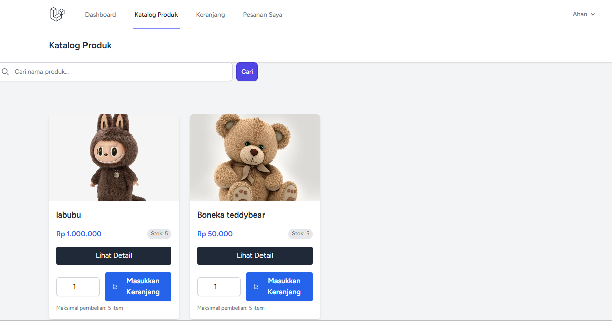
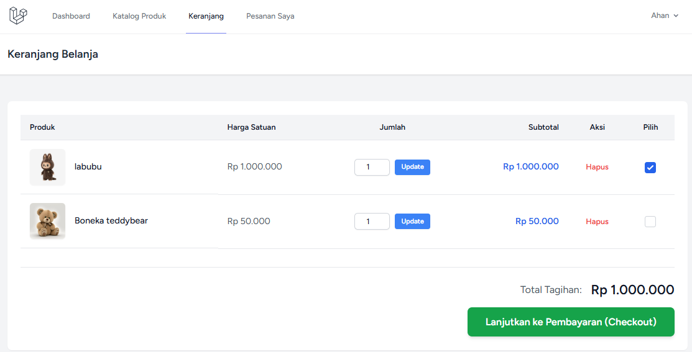
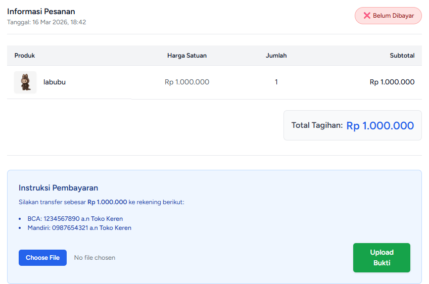
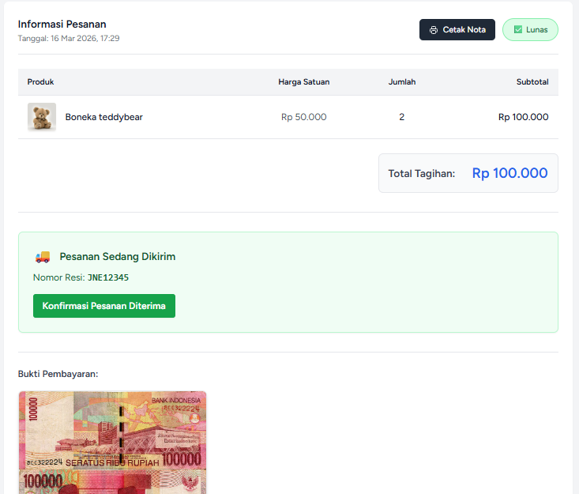
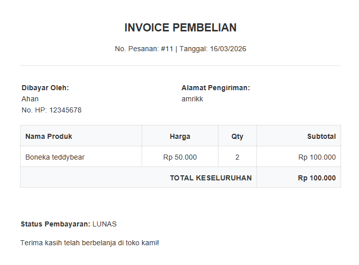
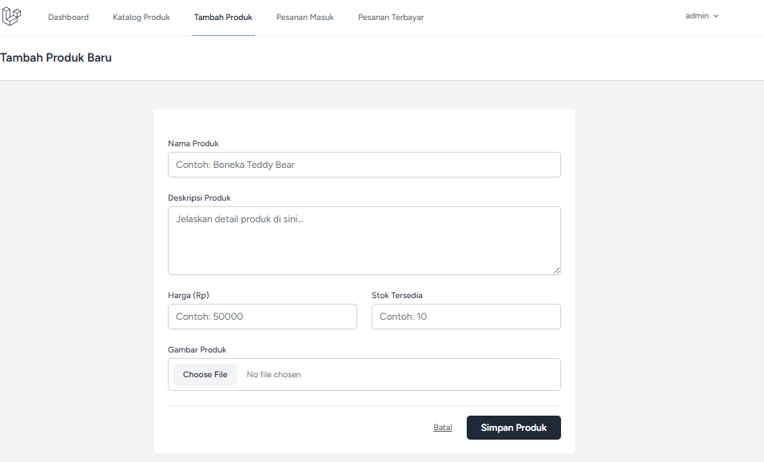
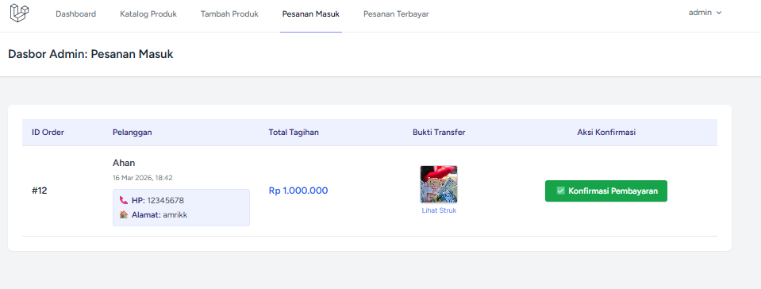
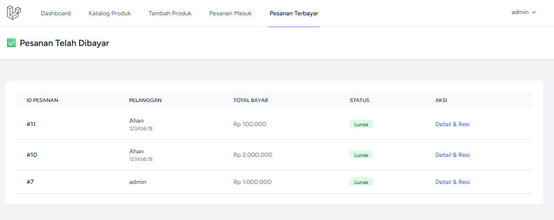

# 🛒 Laravel E-Commerce App

Sebuah aplikasi toko *online* (e-commerce) yang simpel namun memiliki fitur lengkap. Dibangun menggunakan kerangka kerja Laravel, aplikasi ini menangani seluruh alur belanja mulai dari memilih produk, *checkout*, unggah bukti transfer, hingga pelacakan nomor resi dan cetak nota (PDF).

## ✨ Fitur Utama

Aplikasi ini membagi hak akses menjadi dua peran: **Admin** dan **Pelanggan**.

### 👨‍💼 Fitur Admin
* **Manajemen Produk:** Menambah, mengubah, dan menghapus produk beserta gambarnya.
* **Pesanan Masuk:** Memeriksa pesanan baru dan memvalidasi bukti transfer pembayaran.
* **Pesanan Terbayar & Pengiriman:** Melihat daftar pesanan yang sudah lunas dan memasukkan **Nomor Resi** kurir.

### 👤 Fitur Pelanggan
* **Katalog & Pencarian:** Menjelajahi daftar produk dan mencari produk berdasarkan nama.
* **Keranjang Belanja:** Menambahkan produk ke keranjang dengan batasan jumlah sesuai stok yang tersedia.
* **Checkout & Pembayaran:** Mengunggah foto bukti transfer (*receipt*) untuk diverifikasi admin.
* **Lacak Pesanan:** Melihat status pesanan (Belum Bayar, Menunggu Konfirmasi, Lunas, atau Sedang Dikirim).
* **Konfirmasi Terima Barang:** Tombol untuk menyelesaikan pesanan saat barang sudah sampai.
* **Cetak Nota (PDF):** Mengunduh *invoice* resmi berformat PDF untuk pesanan yang sudah lunas.

## 🛠️ Teknologi yang Digunakan
* **Framework:** Laravel
* **Database:** MySQL
* **Styling:** Tailwind CSS (lewat Laravel Breeze / Blade)
* **PDF Generator:** DomPDF

## 📸 Cuplikan Layar (Screenshots)

<table>
  <tr>
    <td><b>1. Katalog Produk & Pencarian(Admin & Pelanggan)</b></td>
    <td><b>2. Keranjang Belanja(Pelanggan)</b></td>
  </tr>
  <tr>
    <td></td>
    <td></td>
  </tr>
  <tr>
    <td><b>3. Checkout dan Pembayaran(Pelanggan)</b></td>
    <td><b>4. Informasi Pesanan(Pelanggan)</b></td>
  </tr>
  <tr>
    <td></td>
    <td></td>
  </tr>
  <tr>
    <td><b>5. Nota/invoice pdf(Pelanggan)</b></td>
    <td><b>6. Penambahan product(Admin)</b></td>
  </tr>
  <tr>
    <td></td>
    <td></td>
  </tr>
  <tr>
    <td><b>7. Pesanan Masuk(Admin)</b></td>
    <td><b>8. Riwayat Pesanan(Admin)</b></td>
  </tr>
  <tr>
    <td></td>
    <td></td>
  </tr>
</table>